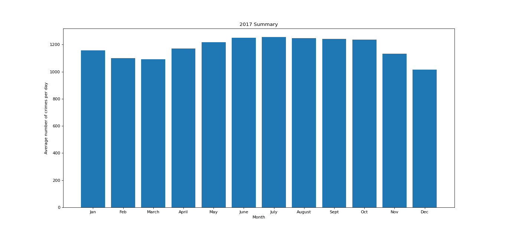
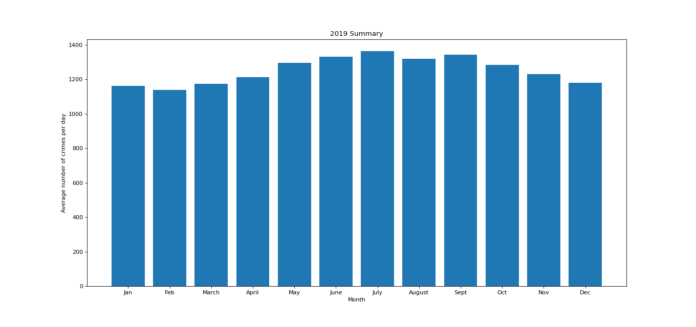
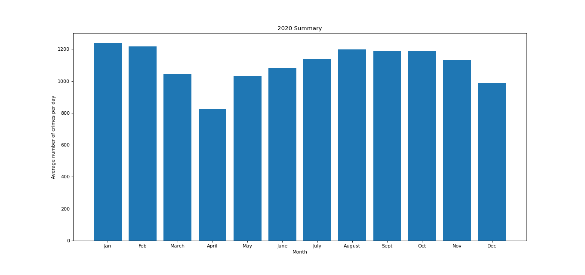
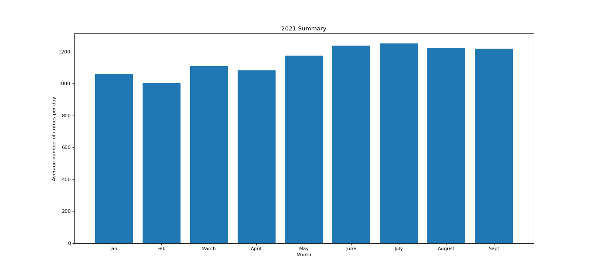

                                      FINAL PROJECT - COVID-CRIME CORRELATION


The covid-19 has brought a lot of changes to the world. The pandemic started at the end of 2019 and spread all over the world. Every country suffered economically and financially and continues to suffer as new variants of the virus emerge. USA
being the biggest country suffered heavily as people lost their lives, jobs, etc. New York City, being one of the biggest cities in the world, saw a lot of covid cases beginning from March 2020. So, my objective is to find the effect of covid-19
on the number of crimes in NYC. My assumption is that they are negatively correlated and hence, crimes went down during the pandemic in NYC. I believe as people were advised to stay inside their homes and in general, people were scared as the world was witnessing a major pandemic for the first time in almost a century, crimes declined as the covid-19 cases went up.

   For testing the correlation between crimes and covid-19 cases, I have used 3 datasets(.csv files)-"NYPD Complaint Data Historic","NYPD Complaint Data Current Year To Date (1)" and "COVID19_Daily_Counts_of_Cases__Hospitalizations__and_Deaths" from NYC Data website. The first dataset contains the record of all the crimes that happened in NYC till mid 2021. The second dataset has all the crimes recorded in NYC in 2021 till September and third dataset has the daily covid-19 cases, deaths, hospitalizations in NYC till October 2021. 
   
The first step was to extract all the data for crimes that happened in 2020 from the "NYPD Complaint Data Historic" and to eliminate some of the bad data using the the try and except method. I made two csv files for 2020. First one having the whole data of 2020 and second one having data from march till december,to test the correlation with covid-19 cases, as covid-19 started in march in NYC. I also filtered data using the strptime method to eliminate rows that do not have a valid date format. I wrote the data row by row in a seperate csv file.

</br>
I used the the following code to achieve this. Row 1 has the date of the crime.
</br>

``` python

for row in reader:
    if n==0:
        writer.writerow(row)
    if n>0:
        date=None
        try:
            date=row[1]
        except:
            continue
        if date is not None:
             dto=None
            try:
                dto=datetime.datetime.strptime(date,"%m/%d/%Y")
            except:
                continue
            if dto is not None:
                if dto>datetime.datetime.strptime('02/29/2020',"%m/%d/%Y") and  dto<datetime.datetime.strptime('01/01/2021',"%m/%d/%Y"):                       
                    writer.writerow(row)
                    
```

Similarly, I created a seperate csv file for 2020 covid cases. The file has date, no. of cases, no. of deaths, no. of people  hospitalized and 7-day moving average of covid-cases for 2020 from march to december.

Next, as my aim is to find the correlation between covid-19 cases and number of crimes in NYC, I had to find the number of crimes for each day that happened in NYC in 2020. I made a seperate csv file having date and number of crimes on that day. I created dictionary and added unique dates as keys and their occurence as the respective value. 

</br>
I used the following code to do this-
</br>

```python

for row in reader:
    if n>0:
        date=row[1]
        if date in d.keys():
            d[date]+=1
        else:
            d[date]=1
    n+=1
    

l1=["Date","Number of crimes"]
writer.writerow(l1)

for k,v in sorted(d.items()):
    l=[k,v]
    writer.writerow(l)
    
```

After getting both, the covid data for 2020 and no. of crimes data for 2020, I combined them into one csv-"2020_Whole_Data".

</br>

I used the following code to to consolidate the data 

</br>

```python

f1=open("NumberOfCrimesPerDay_2020.csv",'r')
reader1=csv.reader(f1)
f2=open("CovidDailyCases_2020.csv",'r')
reader2=csv.reader(f2)
f3=open("2020_Whole_Data.csv",'w')
writer=csv.writer(f3,delimiter=',',lineterminator='\n')

for row1,row2 in zip(reader1,reader2):
    writer.writerow(row1+row2)
    
```

I found the correlation of number of crimes with covid-19 cases, number of deaths, number of people hospitalized and 7-day moving average. Here is the result-

Type of Covid-19 data statistic |     Correlation coefficient      
-------------------------|--------------------------
Case count               |  -0.654
Hospitalized count       |  -0.670
Death count              |  -0.663
Case count 7-day moving avg.   |  -0.745


As we can see, crime is negatively correlated with all the covid-19 statistics. All have good correlation, with 7-day moving average having the strongest correlation with number of crimes(-.745).This proves that there is a moderate correlation between covid-19 cases and crimes. So, when the cases went up, crime decreased in NYC in 2020. 

Then, I wanted to verify my findings for 2021, as then I would have two covid year's data which will strengthen my claim. So I collated the data for 2021 using the same method that I used for 2020 data. I had 9 months of data for 2021 and combined data was stored in "2021_Whole_Data" and then I checked for correlation with the same statistics. Here is  the result_

Type of Covid-19 data statistic |     Correlation coefficient      
-------------------------|--------------------------
Case count               |  -0.455
Hospitalized count       |  -0.589
Death count              |  -0.654
Case count 7-day moving avg.   |  -0.577


We can see that again there is good correlation between covid-19 statistics and number of crimes in NYC. Crime has a moderate negative correlation with covid-19 cases and other statistics. This time death count had the strongest correlation with crimes in NYC. This further strengthens my assumption that crime is negatively correlated with covid-19 cases.

My next objective was to check how different types of crime behaved as the covid cases varied. There is a possibility that some crimes might have gone up during the covid. The 2020 dataset had 58 types of crimes and the 2021 dataset had 61 types of crimes. I wanted to get daily counts of different types of crimes to check their correlation with covid-19 cases. I created a different csv file called "Crime_Grouping" which contains crime-wise daily counts along with their dates. 

</br>
I used the following code for getting the crime-wise counts for each day
</br>

```python

import csv, datetime

f=open("CovidDailyCases_2020.csv",'r')
reader1=csv.reader(f)

count_cases_per_day=[]
n=0
for row in reader1:
    if n>0:
        cases=row[1]
        count_cases_per_day.append(cases)
        
    n+=1

    
f1=open('Crime_complaints_2020.csv','r')
reader=csv.reader(f1)

f2=open('Crime_Grouping.csv','w')
writer=csv.writer(f2,delimiter=',',lineterminator='\n')

n=0
crimes={}
for row in reader:
    if n>0:
        date=row[1]
        crime=row[8]
        if crime!='':
            if crime not in crimes:
                crimes[crime]={}
            if date in crimes[crime]:
                crimes[crime][date]+=1
            else:
                crimes[crime][date]=1
    n+=1
    

base = datetime.datetime.strptime('03/01/2020','%m/%d/%Y')
date_list = [base + datetime.timedelta(days=x) for x in range(306)]
dates=[]
for i in date_list:
    dt=datetime.datetime.strftime(i,'%m/%d/%Y')
    dt1=dt.split
    dates.append(dt)
    
    
n=0
crime_list=[]

for i in crimes.keys():
    crime_list.append(i)
    
crime_list.insert(0,'Date')
crime_list.insert(1,'Total Covid Cases')

writer.writerow(crime_list)
list_final=[]
for date in dates:
    row=[]
    for crime in crimes.keys():
        if crimes[crime].get(date) is None:
            row.append(0)
        else:
            row.append(crimes[crime].get(date))
    
    row.insert(0,date)
    list_final.append(row)
    
    n+=1

m=0
for elements in list_final:
    elements.insert(1,count_cases_per_day[m])
    writer.writerow(elements)
    m+=1

    

f.close()           
f1.close() 
f2.close()
  
```

First I made a list called "count_cases_per_day" which has date-wise covid case count. Then I created a dictionary called "crimes" for the crime types and their counts for each day. The keys of dictionary are the crime types and their value is a dictionary having keys as dates and value as the count of that crime on that day. The structure looks like this-


```JSONasPerl
Crimes
       -Crime1
              -Date1:count1
              -Date2:count2
       -Crime2
              -Date1:count1
              -Date2:count2
```

Then I created a list-"dates" of all the dates from 03/01/2020 to 12/31/2020. Also, in the dictionary "crimes", some of the crimes did not have an occurence on some days, so I put 0 for those days using for loop on "dates" list. Finally, I made a list- "list_final" which had date, covid-cases count and count for different types of crime and wrote it to the "Crime_Grouping csv" file row by row. So, I had date wise occurence of different types of crime along with the covid cases on that day. I checked correlation for every type of crime and the result of the significant ones is given below.

Crime-type              |      Correlation
--------------------------|----------------------
FORGERY                |         0.249
PETIT LARCENY           |          -0.475
ROBBERY                 |          -0.337
HARRASSMENT 2           |           -0.651
FELONY ASSAULT          |           -0.531
SEX CRIMES               |          -0.438
ASSAULT 3 & RELATED OFFENSES | -0.564
GRAND LARCENY            |          -0.520
MISCELLANEOUS PENAL LAW |            -0.317
VEHICLE AND TRAFFIC LAWS |             -0.541
CRIMINAL MISCHIEF & RELATED OF |        -0.384
GRAND LARCENY OF MOTOR VEHICLE |       -0.350
OFF. AGNST PUB ORD SENSBLTY & |         -0.523
OFFENSES INVOLVING FRAUD |              0.233
BURGLAR'S TOOLS |                       0.200
INTOXICATED & IMPAIRED DRIVING |         -0.227
RAPE                           |             -0.228
              
      

As expected, most of the crimes were negatively correlated with the covid-count. But, there are some crimes like 'FORGERY', 'OFFENSES INVOLVING FRAUD', 'BURGLAR'S TOOLS', who had a positive correlation. These crimes went up as the covid-count increased. 

Similarly, I did the crime grouping for 2021 data and found out the crime-wise correlations with covid-count. Some of the significant correlations are given below.

Crime-type              |      Correlation
--------------------------|----------------------
FORGERY                  |          0.217
ROBBERY                  |           -0.490
HARRASSMENT 2             |          -0.526
FELONY ASSAULT            |          -0.573
THEFT-FRAUD               |           0.391
SEX CRIMES                 |           -0.280
ASSAULT 3 & RELATED OFFENSES |        -0.618
GRAND LARCENY                |        -0.264
DANGEROUS DRUGS               |        0.469
MISCELLANEOUS PENAL LAW        |        -0.300
VEHICLE AND TRAFFIC LAWS        |        -0.482
GRAND LARCENY OF MOTOR VEHICLE   |       -0.510
NYS LAWS-UNCLASSIFIED FELONY      |       0.247
FRAUDS                            |        0.393
ANTICIPATORY OFFENSES              |         0.240


Again, most of them were negatively correlated with the covid count. Interestingly, some crimes like "Theft frauds", "frauds","Dangerous drugs" had a good positive correlation with covid case count.

Moreover, I wanted to check the variation of crimes from one year to another. For this purpose, I made 3 pairs- 2017-2019, 2019-2020, 2020-2021 to check the difference in average crimes per day for each month. I did not take the 2018 year data as it had only aroud 9000 rows as compared to more than 300,000 rows for other years. The NYS historic crimes data was faulty as it omitted almost all 2018 data. I made sure that I did not have eough data points for 2018 by checking if there are many missing values in date column or if there are many values in date column that do not match the date format, that could have belonged to 2018 year.

</br>
I used the following code to make sure that the dataset was faulty
</br>

```python

for row in reader:
    if n>0:
        dto=None
        try:
            if row[1]=='':
                c+=1
        except Exception as e:
            print(e,row)
        try:
            dto=datetime.datetime.strptime(row[1],"%m/%d/%Y")
        except:
            continue
        if dto is None:
            c+=1
    n+=1
    
print(c)

```

Including "c"( which is equal to 531) from this code which is non-date type value or blank value, the total number of rows in 2018 dataset was not crossing 10k. Therefore, I did not select 2018 year data as it would not have been good for comparison with other years. 
 
I proceeded to create seperate csv's for 2017, 2019, 2020 and 2021. The csv had dates and crime counts for that day.Then, I took the total number of crimes in a month and divided it by the number of days in that month to get the average crime count per day for each month and made a dictionary with keys as months and their values as average number of crimes per day. Finally, I made their histograms using the code below.

```python


plt.bar(range(len(d)), d.values(), align='center')
plt.xticks(range(len(d)), list(d.keys()))
plt.xlabel('Month')
plt.ylabel('Average number of crimes per day')
plt.title('2019 Summary')
plt.savefig('2019_AverageCrimes_by_month.png')

```

The histograms helped in seeing the difference from one year to another. The histograms of all years are given below-










We can clearly see the dip in crimes in 2020 starting from March and and continuing till July, which was the duration of the first covid-19 wave. In April, crime was at its low due to partial lockdowns which restricted people to go outside their homes. Also, we can notice that in every year(except 2020) the crimes are at their peak in summer(June-August) and decrease during winter. 

I also calculated the difference between monthly average crime count per day for 2017-2019,2019-2020 and 2020-2021. The tables are given below-

</br>

Difference between 2017 and 2019

</br>


Month  |  Difference
--------|------------
January | -4
February | -38
March | -83
April | -42
May | -78
June | -81
July | -108
August | -73
September | -99
October | -45
November | -96
December | -165


</br>

Difference between 2019 and 2020

</br>
 
Month  |  Difference
--------|------------
January | -77
February | -81
March | 129
April | 387
May | 265
June | 249
July | 225
August | 121
September | 154
October | 96
November | 99
December | 191 


</br>

Difference between 2020 and 2021. I cacluted the difference till september, as for 2021 year I had data till september only.

</br>

Month  |  Difference
--------|------------
January | 182
February | 213
March | -65
April | -257
May | -145
June | -156
July | -113
August | -26
September | -30


Looking at the first table(2017-2019), I found out that crimes have increased in general. All the months in 2019 had more crimes than 2017.

In the second table, we can see that crimes dropped drastically in 2020 when compared to 2019. The months of January and February had more crimes than the previous year, but it dropped suddenly in March due to covid-19 and remained lower than 2019 for the rest of the year.

In  the 2020-2021 table, we can see that in 2021 the crimes were less in Jan and Feb than in Jan and Feb in 2020 (pre-covid) period, but after that crimes are more in 2021. We can conclude that the first wave(in 2020) was more severe and therefore, crimes reduced drastically during that period. I also calculated the average crime count per day for every year and found out that it was highest in 2019 and lowest in 2020. So, crimes were increasing year by year before covid hit(which is also proved by comapring jan and feb months of 2019 and 2020. Jan and Feb in 2020 had more crimes than 2019). Crimes decreased by 11.7% in 2020, but since the pandemic situation got under control, crimes increased again in 2021, but it is still below the pre-covid period(2019), which means that covid-19 still continues to impact crimes in NYC. Also, average number of crimes per day is expected to decrease in 2021 when the rest of the data gets released, as crimes drop after summer.


Year  |  Average number of crimes per day
------|----------------------------------
2017  |         1176
2019  |         1253
2020  |         1106
2021  |         1153


Conclusion- Through all the techniques and methods that I have used in this project, I conclude that covid-19 has definitely impacted crimes in NYC. The crime count in 2020 had a good(-0.654) correlation with covid cases count and in 2021 the correlation was weaker(-0.455) than 2020, which proves that first wave of covid had a severe impact on crimes. Some of the crimes in 2020 like 'FORGERY', 'OFFENSES INVOLVING FRAUD', 'BURGLAR'S TOOLS' had a significant positive correlation with cavid-19 cases and similarly in 2021 crimes like "Theft frauds", "frauds","Dangerous drugs" had a good positive correlation with covid-cases. This means that covid-19 impacted different types of crimes differently and some crimes grew in covid period. Also, I noticed that crimes were increasing year by year till the pandemic started. After that, there was a significant decline in crimes in NYC and post covid first wave the crimes increased again, but they are still lower that the pre-covid period. This proves that the pandemic continues to impact the crimes in NYC.